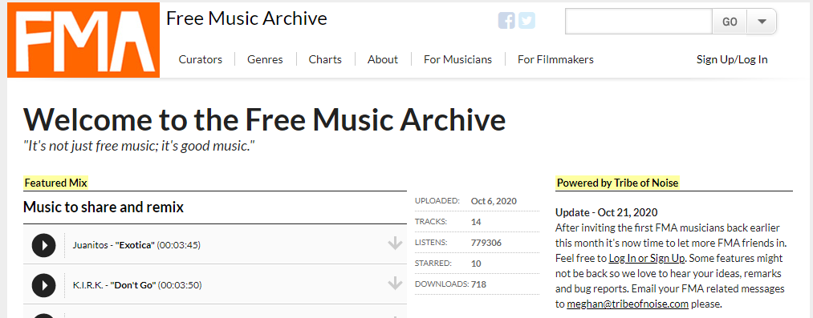

¿Conoces el proyecto [Free Music Archive](https://www.freemusicarchive.org/home)?

Se trata de un repositorio online dedicado a alojar música libre. Su objetivo es proporcionar un archivo de música con licencias Creative Commons, que se puedan descargar libremente y usar en otros trabajos derivados.

Las obras publicadas en FMA están revisadas y son trabajos de calidad. Además, la página permite a los usuarios que descargan estas obras hacer donaciones a sus compositores.

### Historia del FMA

Este proyecto surgió en 2009 de la mano de [WFMU](https://wfmu.org/), [KBOO](https://kboo.fm/) y [KEXP](https://www.kexp.org/), emisoras de radio independientes de EEUU. En 2016 el catálogo llegó a sobrepasar las 100.000 canciones, pero en 2018 se anunció el cierre del proyecto debido a la falta de financiación.

Los archivos ya existentes se trasladaron a [TheInternetArchive](https://archive.org/). Es una biblioteca digital que aboga por el acceso universal al conocimiento en Internet, y que aloja todo tipo de ficheros: copias de páginas web, software, música, libros...  

)

En 2019 el proyecto [FMA fue adquirido](https://www.prweb.com/releases/global_music_community_tribe_of_noise_acquires_free_music_archive/prweb16583352.htm) por [TribeofNoise](https://www.tribeofnoise.com/), una red social destinada a músicos que comparten su música. Esta red añadió las canciones de FMA a su propio catálogo libre, expandiendo así la colección.

En mayo de 2020 Tribe of Noise [recibió el premio "Grant for the Web"](https://www.grantfortheweb.org/blog/free-music-archive), por desarrollar nuevos modelos de negocio online basados en estándares abiertos, y por apoyar el acceso a la música libre.

### Tribe of Noise PRO

Algunas canciones publicadas en Tribe of Noise están limitadas al ámbito Non Commercial. Esto quiere decir que se pueden usar libremente siempre que no sea un proyecto remunerado. Para poder usar estas canciones con ese fin, TribeOfNoise también mantiene una [tienda](https://prosearch.tribeofnoise.com/search/index) que permite a los artistas poner un precio para el uso de sus canciones en proyectos audiovisuales comerciales. 

### Enlaces de interés

* [Catálogo clásico del FMA](https://www.freemusicarchive.org/home)

* [Catálogo del FMA en Internet Archive](https://archive.org/details/freemusicarchive)

* [Adquisición del FMA por TribeOfNoise](https://www.prweb.com/releases/global_music_community_tribe_of_noise_acquires_free_music_archive/prweb16583352.htm)

* [El FMA recibe el premio 'Grant for the Web'](https://www.grantfortheweb.org/blog/free-music-archive)